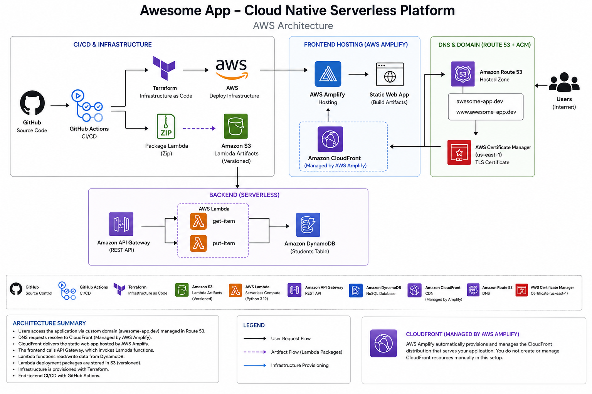

# 🚀 Cloud-Native Serverless Student Management Platform on AWS

<p align="center">


</p>

---

# Cloud-Native Serverless Student Management Platform on AWS

A production-inspired serverless Student Management platform built entirely on AWS using Infrastructure as Code (Terraform), GitHub Actions for CI/CD, and modern AWS managed services.

The project demonstrates how to build, automate, deploy, and operate a cloud-native application using modular Terraform, serverless architecture, automated infrastructure deployment, frontend hosting with AWS Amplify, and continuous delivery through GitHub Actions.

---

# 📖 Table of Contents

- [Project Overview](#project-overview)
- [Architecture](#architecture)
- [Features](#features)
- [Technology Stack](#technology-stack)
- [AWS Services Used](#aws-services-used)
- [Repository Structure](#repository-structure)
- [Terraform Modules](#terraform-modules)
- [Architecture Flow](#architecture-flow)
- [CI/CD Pipelines](#cicd-pipelines)
- [Deployment Workflow](#deployment-workflow)
- [Getting Started](#getting-started)
- [Prerequisites](#prerequisites)
- [Deployment](#deployment)
- [Application Walkthrough](#application-walkthrough)
- [Testing](#testing)
- [Future Improvements](#future-improvements)
- [Lessons Learned](#lessons-learned)
- [Author](#author)

---

# Project Overview

This project was created to gain hands-on experience designing and deploying a complete cloud-native serverless application on AWS.

Rather than deploying individual AWS services independently, the goal was to build an end-to-end production-inspired platform using Infrastructure as Code and CI/CD best practices.

The application allows users to:

- Add students
- Retrieve student records
- Store data in DynamoDB
- Access the application securely through a custom domain
- Deploy infrastructure automatically
- Deploy frontend automatically
- Deploy backend automatically

Everything is provisioned using reusable Terraform modules.

---

# Architecture

<p align="center">



</p>

---

# Features

- Serverless backend
- Responsive frontend
- Student registration
- Student retrieval
- DynamoDB integration
- HTTPS enabled
- Custom Route53 domain
- AWS Certificate Manager SSL
- Modular Terraform
- GitHub Actions CI/CD
- Automatic Amplify deployments
- Lambda artifacts stored in Amazon S3
- Production-inspired repository structure

---

# Technology Stack

| Category | Technology |
|------------|----------------|
| IaC | Terraform |
| CI/CD | GitHub Actions |
| Frontend Hosting | AWS Amplify |
| Compute | AWS Lambda |
| API | API Gateway HTTP API |
| Database | Amazon DynamoDB |
| Artifact Storage | Amazon S3 |
| DNS | Amazon Route53 |
| SSL | AWS Certificate Manager |
| CDN | Amazon CloudFront (Managed by AWS Amplify) |
| Language | Python |
| Frontend | HTML, CSS, JavaScript |

---

# AWS Services Used

| AWS Service | Purpose |
|--------------|-----------|
| AWS Amplify | Frontend hosting |
| API Gateway | REST API |
| Lambda | Backend compute |
| DynamoDB | Student database |
| Amazon S3 | Lambda artifacts |
| Route53 | DNS |
| ACM | SSL Certificate |
| CloudFront | Global CDN (Managed by Amplify) |
| IAM | Permissions |
| CloudWatch | Logging & Monitoring |

---

# Repository Structure

```text
cloud-native-serverless-platform/

├── .github/
│   └── workflows/
│       ├── terraform-pr.yml
│       ├── terraform-deploy.yml
│       └── lambda-deploy.yml
│
├── backend/
│   ├── get_item/
│   └── put_item/
│
├── frontend/
│
├── terraform/
│   ├── environments/
│   └── modules/
│
├── architecture.png
│
└── README.md
```

---

# Terraform Modules

```text
terraform/modules

├── amplify
├── apigateway
├── dynamodb
├── iam
├── lambda
├── route53
└── s3
```

Each AWS service is implemented as an independent reusable Terraform module following Infrastructure as Code best practices.

---

# Architecture Flow

```text
User

↓

Amazon Route53

↓

AWS Certificate Manager

↓

AWS Amplify Domain Association

↓

Amazon CloudFront
(Managed by AWS Amplify)

↓

AWS Amplify Hosting

↓

Frontend (HTML/CSS/JavaScript)

↓

Amazon API Gateway

↓

AWS Lambda

↓

Amazon DynamoDB
```

---

# CI/CD Pipelines

## Pipeline 1 — Terraform Validation

Trigger

Pull Request

Runs

- terraform fmt
- terraform validate
- terraform plan

Purpose

Ensures infrastructure changes are valid before merging.

---

## Pipeline 2 — Infrastructure Deployment

Trigger

Push to main

Runs

- terraform init
- terraform apply

Purpose

Automatically provisions infrastructure updates.

---

## Pipeline 3 — Lambda Deployment

Trigger

Changes inside

```text
backend/**
```

Runs

- Package Lambda
- Upload artifacts to Amazon S3
- Deploy updated Lambda functions

Purpose

Separates application deployment from infrastructure deployment.

---

## Frontend Deployment

AWS Amplify is connected directly to GitHub.

Whenever changes are pushed to the main branch, Amplify automatically rebuilds and redeploys the frontend.

---

# Deployment Workflow

```text
Developer

↓

Git Push

↓

GitHub Actions

├──────────────┐
│              │
Terraform      Lambda
Validation     Deployment
│              │
└──────┬───────┘
       │
Terraform Apply

↓

AWS Infrastructure

↓

Amplify Build

↓

CloudFront

↓

Student Management Platform
```

---

# Getting Started

Clone the repository

```bash
git clone https://github.com/seidutee/cloud-native-serverless-platform.git

cd cloud-native-serverless-platform
```

---

# Prerequisites

- AWS Account
- Terraform
- Git
- GitHub
- AWS CLI
- Python 3
- GitHub Personal Access Token

---

# Deployment

Initialize Terraform

```bash
terraform init
```

Validate

```bash
terraform validate
```

Plan

```bash
terraform plan
```

Deploy

```bash
terraform apply
```

---

# Application Walkthrough

The application allows users to:

- Enter a Student ID
- Enter a Student Name
- Save the student to DynamoDB
- Retrieve all stored students
- View records immediately from the frontend

The backend consists of two AWS Lambda functions:

### PUT Lambda

Receives student information through API Gateway and stores the record in DynamoDB.

### GET Lambda

Retrieves all student records from DynamoDB and returns them to the frontend.

---

# Testing

## Save Student

```bash
curl -X POST \
https://<api-id>.execute-api.us-east-1.amazonaws.com/students \
-H "Content-Type: application/json" \
-d '{"id":"1","name":"Alice"}'
```

Expected response

```json
{
  "message":"Student saved successfully."
}
```

---

## Retrieve Students

```bash
curl https://<api-id>.execute-api.us-east-1.amazonaws.com/students
```

Expected response

```json
[
  {
    "id":"1",
    "name":"Alice"
  }
]
```

---

# Future Improvements

- GitHub OIDC Authentication
- Multiple Terraform environments
- Remote Terraform State Locking
- Lambda Versioning
- Blue/Green Deployments
- Monitoring Dashboard
- AWS WAF
- Cost Monitoring
- Unit Testing
- Integration Testing

---

# Lessons Learned

This project provided hands-on experience with:

- Infrastructure as Code
- Modular Terraform
- Serverless Architecture
- GitHub Actions
- AWS Amplify
- API Gateway
- AWS Lambda
- DynamoDB
- Route53
- ACM
- Amazon S3
- CloudFront
- CI/CD Pipeline Design
- DNS Configuration
- HTTPS Certificates
- Terraform Module Design
- Frontend/Backend Integration
- Cloud Architecture

The project also reinforced the importance of troubleshooting cloud-native applications by working through issues related to API Gateway routing, Lambda packaging, Amplify deployments, Terraform modules, DNS configuration, and frontend/backend integration.

---

# Author

## T. Seidu

Cloud Engineer | DevOps Engineer

Building cloud-native infrastructure one project at a time.

If you found this project useful or have feedback, feel free to connect with me on LinkedIn or explore the repository.